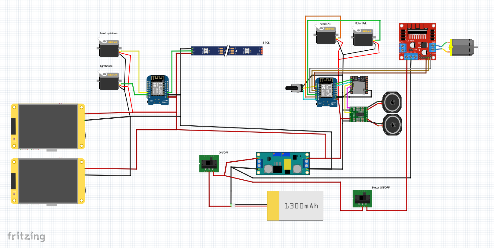

# M-O_ESP-NOW_protokol_tansmitter
Here you will find all the information about my way of controlling M-O from the Wall-e story. Don't look for the 3D model of M-O here! You will find it in the WALL-E Builders Club community files.

# M-O Control ESP NOW – Sedláček 🤖

This project utilizes the **ESP NOW** protocol for wireless robot control. The system is divided into a **Controller (Transmitter), Head, Eyes, and Body units**.

---

## 📑 Project Overview

- **Control Protocol:** Uses ESP NOW where eye displays process data as numbers **1–7** and display images accordingly.  
- **Head Unit:** Processes up/down movement (**0–180** from joystick) and controls the beacon.  
- **Body Unit:** Controls driving direction, speed, head rotation, and plays sounds.  
- **Security:** Communication is locked to specific MAC addresses to prevent accidental control of different robots.  

📄 **Full Documentation:**  
See the detailed manual here → [instruction.pdf](instruction.pdf)

---

## 🛠️ Hardware & Wiring

Detailed wiring diagrams can be found on **page 4** of the documentation.

### 🔌 Robot Wiring Diagram



### 🎮 Transmitter Wiring Diagram


---

## 📡 MAC Address Configuration

The first essential prerequisite is identifying the MAC addresses of all units.

### Identification
Use the **“MAC address code”** sketch to print the address to the Serial Monitor.

### Formatting

Rewrite addresses from:

A4:B0:0F:83:0C:8C

to:

0xA4, 0xB0, 0x0F, 0x83, 0x0C, 0x8C

### Implementation

- **Body & Head Code:** Replace the address on **line 7**  
- **Eyes Code:** Replace the address on **line 12**  
- **Transmitter Code:** Enter the MAC addresses of all other ESPs into **lines 30–33**

Detailed steps are on **page 1** of the manual → [instruction.pdf](instruction.pdf)

---

## 💻 Software Setup & Libraries

To ensure library compatibility, you must use these specific versions:

- **ESP32 Board Core:** 3.3.7  
- **TFT_eSPI:** 2.5.43  
- **Tjpg_Decoder:** 1.1.0  
- **SD:** 1.3.0  

> **Note:** Select **ESP32 Dev Module** when uploading.  
> The provided configuration file must be added to the `TFT_eSPI-master` library.

---

## 📂 SD Card & Multimedia

- **Images:** Upload images directly to the **root directory** (do not use folders).  
- **Sounds:** Rename files **0001 – 0050** and place them in a folder named `mp3`.  

**Eye Rotation (line 75):**

```cpp
tft.setRotation(3);
```

- Use **1** for the right eye  
- Use **3** for the left eye

---

## 💡 Tips and Observations

- **Weight Management:** Do not 3D print the head too heavy; use a maximum of **2 perimeters** to prevent the robot from tipping over.  
- **Safety / Demo Mode:** A power switch for the motor driver allows children to control eyes/sounds without the robot moving.  
- **Wiring:** Use the connector where **RX and TX** are located for **5V input** (**Do not connect the RX and TX pins!**)  

More observations are available in the manual → [instruction.pdf](instruction.pdf)

---

## 👤 Author

**MS3DprintSK (Sedláček)**
This work is licensed under a CC BY-NC 4.0 License. Attribution to MS3DprintSK (Sedláček) is required.
